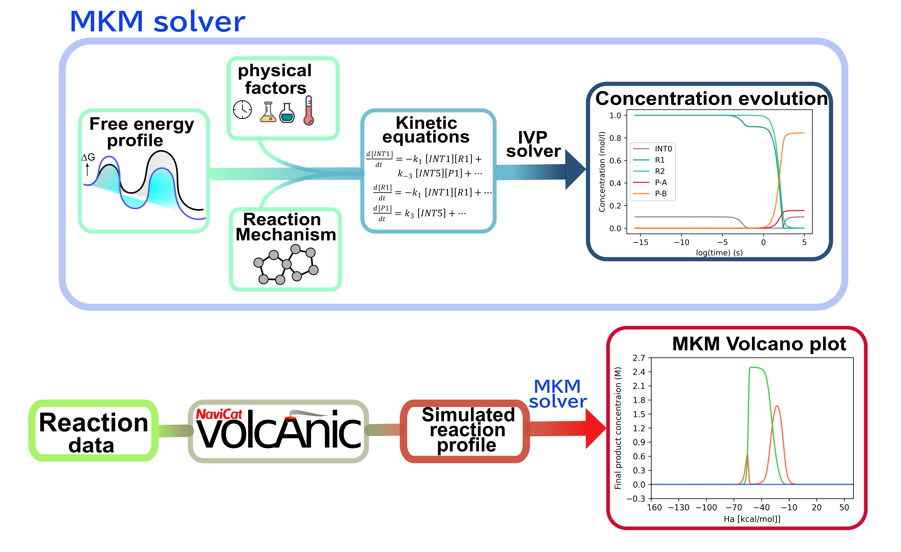

# Spectre: micorkinetic modeling for homogeneous reaction and its integraton with volcannic from Navicat platform



<details>
    <summary style="cursor: pointer;">
        ☄️ Why considering microkinetic modelling? ☄️
    </summary>
    <p>
        <li>Complicate reaction pathway thermodynamics and kinetics</li>
        <li>Account for physical factors: temperature effect, concentration effect, reaction time
    </p>
</details>


<details>
    <summary style="cursor: pointer;">
        ☄️ What is the MKM volcano plot? ☄️
    </summary>
    <p>
        <li>Volcano plot:  plot between the activity (or reactivity) of catalysts and the descriptor variable based on free energy scaling relationships (typically linear (LFESRs)) </li>
        <li>MKM volcano plot: the activity is expressed as the final product concentration 
    </p>
</details>

## Contents 
* [Dependencies](#dependencies-)
* [Install](#install-)
* [Usages](#usages-)
* [Examples](#examples-)
* [Known Limitation](#limitation-)
* [Citation](#citation-)


## Dependencies [↑](#dependencies)
The code runs on pure python with the following dependencies: 
- `numpy`
- `scipy`
- `autograd`
- `matplotlib`
- `pandas`
- `scipy`
- `h5py`
- `fire`
- `navicat_volcanic`

## Install [↑](#install)

```python
pip install .
```

or 

```python
python setup.py install
```

## Usages [↑](#usages)

The user requires three essential inputs for the analysis: energy data, reaction network, and initial concentrations. All these files must be in the same directory.

- energy data: reaction_data (in csv or xlsx)
- reaction network: rxn_network (in csv or xlsx)

The reaction network should be presented as a CSV or XLSX file named "rxn_network". Each row in the network represents an elementary step, while the columns represent the chemical species involved in the mechanism, excluding transition states. When filling in the reaction network, it is crucial to ensure that the species names match those in the energy data.

For each step (denoted as *i*) in the reaction network, assign a value of *-n* to the species on the left side of the equation and *+n* (or simply *n*) to the species on the right side, where *n* represents the stoichiometric coefficient. If a chemical species is not involved in step i, leave the corresponding cell empty or fill it with 0.


The initial concentrations should be specified in the last row of the reaction network file. This row can be named "c0", "initial_conc," or "initial conc." 


Once all input are ready

1. Call just kinetic solver
```python
python -m spectre mkm -d [DIR]
```
2. MKM for all reaction profiles
```python
python -m spectre vp -d [DIR] -nd 0
```

3. To construct MKM volcano plot
```python
python -m spectre vp -d [DIR] -nd 1
```

3. To construct MKM activity/selectivity map
```python
python -m spectre vp -d [DIR] -nd 2
```

4. To screen over reaction time and temperature
```python
python -m spectre cond -d [DIR] 
```

5. To smoothen the volcano 
```python
python replot.py [i]
```

## Examples [↑](#examples)

1. Performing MKM for Pd-catalyzed carbocyclization-borylation of enallene in the
presence of chiral phosphoric acid at room temperature for 1 min of reaction time: 
```python
python -m spectre mkm -d test_cases/pd_carbocylic_borylation/ -t 298.15 -Tf 60
```

2. Performing MKM for all profiles of the catalytic 
competing carboamination and cyclopropanation of N -enoxyphathanalimides with alkenes (353.15 K, 1 d):
```python
python -m spectre vp -d volcanic_test/CA_CP_selectivity/ -t 353.15 -nd 0
```

3. Constructing MKM volcano plot for the catalytic
competing carboamination and cyclopropanation of N -enoxyphathanalimides with alkenes (353.15 K, 1 d):
```python
python -m spectre vp -d volcanic_test/CA_CP_selectivity/ -t 353.15 -nd 1 -ncore 24
```

4. Constructing MKM activity/selectivity map for the catalytic
competing carboamination and cyclopropanation of N -enoxyphathanalimides with alkenes (353.15 K, 1 d):
```python
python -m spectre vp -d volcanic_test/CA_CP_selectivity/ -t 353.15 -nd 2 -ncore 24
```

5. Construct activity/selectivity map with time [2-24 hr] and temperature [273.15-423.15 K] as descriptors

```python
python -m spectre cond -d test_cases/pincer_CO2_jacs/ -tt -Tf 7200 86400 -t 273.15 423.15 -ncore 24
```

6. Use filter algorithm to smoothen the plot

```python
python replot.py examples/data/data.h5 -p 3 3 3 -w 20 20 20
```

You can also find examples of reading h5 files and regenerating plots in the "examples" folder.

## Known Limitation [↑](#limitation)

1. The overlapping states of different pathways after they converge before the referenece state (starting point).

2. bridging states between pathways 

3. Different TSs connecting the same 2 intermediates: just choose the lowest one

## Citation [↑](#citation)

If you use spectre in your work, please cite:
